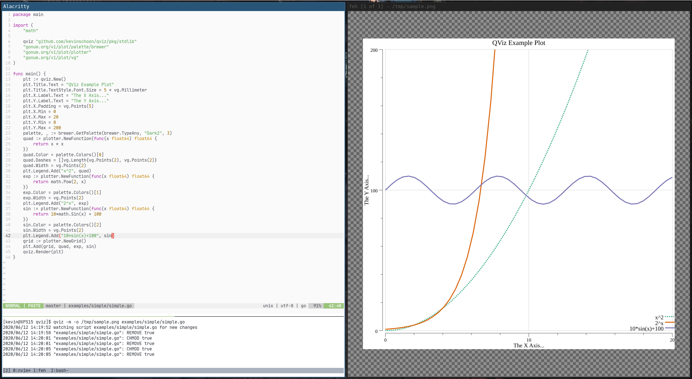

QViz is a utility to quickly and interactively visualize data with by evaluating Go source code at runtime. It works by exposing the [gonum/plot](https://github.com/gonum/plot/) library to a [yaegi](https://github.com/containous/yaegi/) interpreter. Beware that this is very incomplete and buggy software for the moment.



## Usage

```text
Usage: qviz [OPTIONS] SCRIPT_PATH

Generate plots by writing Go scripts

Arguments:
  SCRIPT_PATH     path to a qviz script file

Options:
  -m, --monitor   monitor the script for changes running on each modification
      --width     image width (inches) (default 9)
      --height    image height (inches) (default 9)
  -o, --out       write the plot to this path (default "/dev/stdout")
  -t, --type      type of file to output [eps,jpg,pdf,png,svg,tiff]
```

### Interactive Usage
There are several approaches that can be used to display a plot interactively while editing script files. On Linux
the [feh](https://feh.finalrewind.org/) X11 image viewer works nicely monitoring the output image for changes.
```bash
# Monitor the simple.go script file for changes in real time
qviz --monitor -out /tmp/simple.png examples/simple/simple.go
# Next in a separate pane you can use an image viewer like feh
feh /tmp/simple.png
# now finally open up the script file in your favorite editor
vim examples/simple/simple.go
```

## Writing Scripts

Valid QViz scripts are normal Go files that import the `pkg/stdlib` overlay package. 
Example scripts can be found [here](/examples).

```go
package main

import qviz "github.com/kevinschoon/qviz/pkg/stdlib"

func main() {
    // qviz.New is a convenience function that returns a
    // new *plot.Plot 
    plt := qviz.New()
    plt.Title.Text = "My New Chart"
    // qviz.Render must be called at the end of your script file and only once,
    // calling it before hand will halt the execution of the program.
    qviz.Render(plt)
}
```

## Roadmap

- [ ] CLI based plotter
- [ ] allow external user defined packages
- [x] first class integration with [qframe](https://github.com/tobgu/qframe)
- [x] finish importing the remaining Gonum packages
- [ ] native UI / code editor...?
